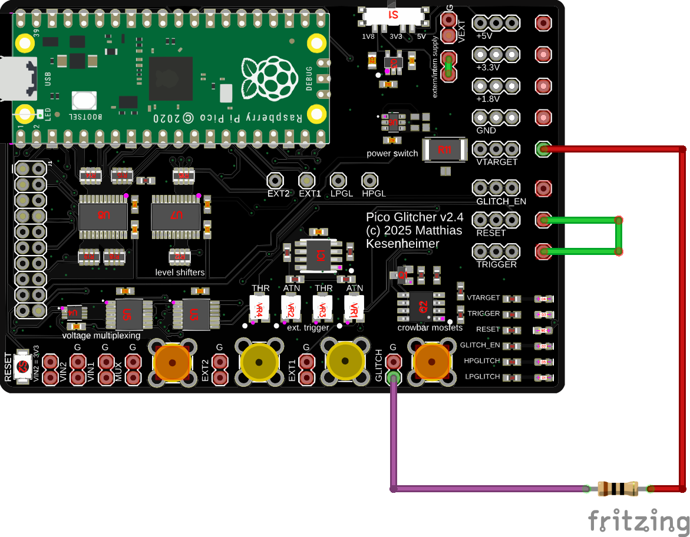

# Using the analog digital converter
The Pico Glitcher includes an ADC that allows you to capture and analyze voltage traces while performing fault injection attacks. This guide explains how to configure and use the ADC for glitch analysis.

## Test setup

The ADC input is connected to the glitch-out line. For the test setup, connect a small resistor (~10Ω) between `VTARGET` and `GLITCH`.



First, import the necessary module and initialize the glitcher:

```python
from findus import AnalogPlot

# initialization
glitcher = DerivedGlitcher()
glitcher.rising_edge_trigger()
```

- `DerivedGlitcher()` initializes the Pico Glitcher.
- `glitcher.rising_edge_trigger()` sets the trigger to activate on a rising edge of the `TRIGGER` signal, ensuring the ADC starts sampling when the trigger condition is met.

Next, configure the ADC:

```python
# plot the voltage trace while glitching
number_of_samples = 1024
sampling_freq = 450_000
glitcher.configure_adc(number_of_samples=number_of_samples, sampling_freq=sampling_freq)
plotter = AnalogPlot(number_of_samples=number_of_samples, sampling_freq=sampling_freq)
```

- `number_of_samples` defines how many ADC readings are taken per capture.
- `sampling_freq` sets the sampling frequency (450 kHz in this case).
- `glitcher.configure_adc(...)` configures the ADC with the given parameters.
- `AnalogPlot(...)` initializes a plotting tool to visualize the collected data.


## Sampling Process

The ADC starts sampling when the trigger condition is met. The following code demonstrates the main loop where glitches are applied, and the ADC captures the voltage trace:

In the glitch loop:
```python
while True:
    # arming and other stuff
    ...

    # arm the adc
    glitcher.arm_adc()
    # triggering and reading the targets response
    ...

    # plotting the analog samples
    samples = glitcher.get_adc_samples()
    plotter.update_curve(samples)
```
- The function `glitcher.arm_adc()` prepares the ADC to capture samples when triggered. This must be done before triggering a glitch to ensure the ADC triggers when the trigger condition is met.
- `glitcher.get_adc_samples()` retrieves the recorded ADC data.
- `plotter.update_curve(samples)` updates the visualization with the new samples, allowing you to analyze how the voltage changes during the glitching campaign.


## Example Usage

To execute an example script utilizing the ADC functionality with the Pico Glitcher, see `fault-injection-library/examples/pico-glitcher.py`. Run:

```bash
python pico-glitcher.py --rpico /dev/tty.usbmodem1101 --delay 1000000 1000000 --length 1000 1000
```

This script sets up the Pico Glitcher with a USB connection (`/dev/tty.usbmodem1101`), applies specific delay values, and defines glitch length parameters.
With this setup the voltage trace and, for example, where the glitch should be applied, can be observed with the ADC.

