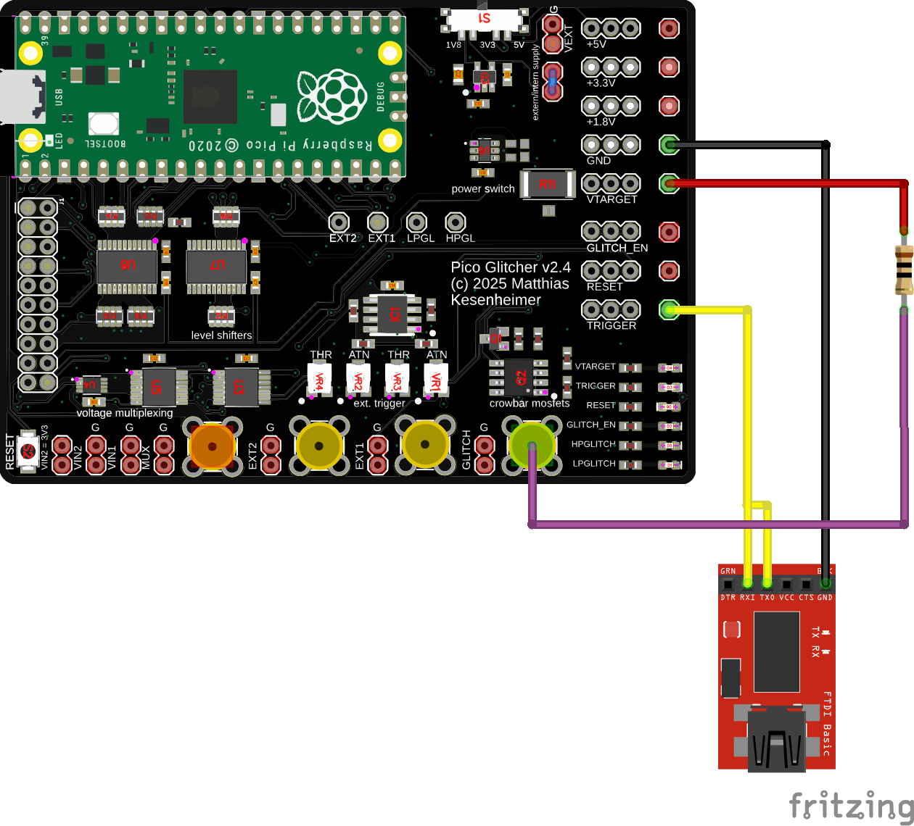
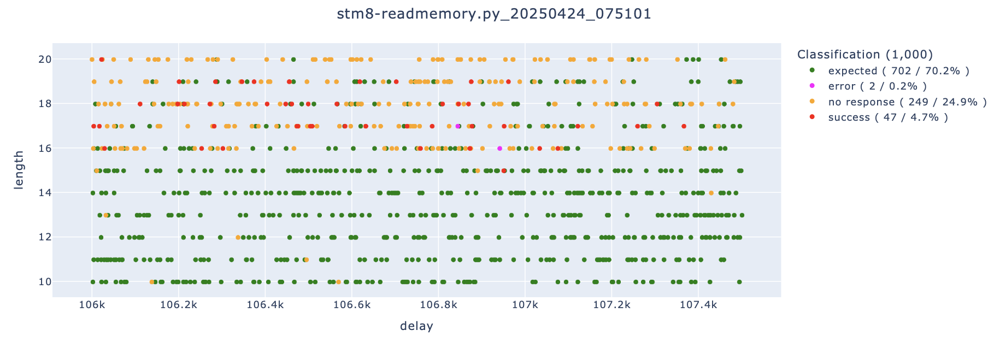

# Example Projects

Start your glitching career with these examples.

## Important

Some connections on the Pico Glitcher are not obvious and incorrect connection can lead to errors or even destruction of the hardware. So be especially careful when rebuilding the following examples. In particular, be aware that some pin headers carry both the signal and a connection to GND. The following pins on the signal lines, marked with a capital 'G', are connected to GND.


## Test the functionality of your Pico Glitcher

The following  setup can be used to test the Pico Glitcher.

- Connect 'TRIGGER' input with 'RESET'.
- Between 'GLITCH' and 'VTARGET', connect a 10 Ohm resistor (this is the test target in this case).
- Optionally connect channel 1 of an oscilloscope to 'RESET' and channel 2 to 'GLITCH'.


Next, run the test script `pico-glitcher.py` located in `fault-injection-library/examples`:

```bash
cd examples
python pico-glitcher.py --rpico /dev/<rpi-tty-port> --delay 1000 1000 --length 100 100
```

You should now be able to observe the glitches with an oscilloscope on the 10 Ohm resistor.
Measure the expected delay and glitch length with the oscilloscope.

## UART Trigger

- Connect 'TRIGGER' input to 'RX' and 'TX' of a USB-to-UART adapter
- Between 'GLITCH' and 'VTARGET', connect a 10 Ohm resistor (this is the test target in this case).
- Optionally connect channel 1 of an oscilloscope to 'RESET' and channel 2 to 'GLITCH'.



Next, run the test script `pico-glitcher-uart.py` located in `fault-injection-library/examples`:

```bash
cd examples
python pico-glitcher-uart-trigger.py --rpico /dev/<rpi-tty-port> --target /dev/<target-tty-port> --delay 1000 1000 --length 100 100
```

You should now be able to observe the glitches with an oscilloscope on the 10 Ohm resistor.
Measure the expected delay and glitch length with the oscilloscope.

## Edge Counting Trigger

<TODO>

## STM8s Glitching

Difficulty: Simple

If you have the STM8s target board (available [here](https://www.tindie.com/products/faulty-hardware/stm8-target-board/)), you can learn how to atttack targets with findus and the Pico Glitcher. The STM8s MCUs are very easy to glitch.

Similar to the STM32 series, the STM8s has a configurable read-out protection (ROP), which can be used to protect the flash content from unauthorised access. However, the STM8s does not have a UART bootloader like a MCU from the STM32 series (see [STM32 glitching](#stm-black-pill-stm32f401-glitching)), meaning that an ST-Link programming adapter would be required for an example target.

In order to have a simple test target and also a realistic scenario, a STM32-like UART bootloader was developed for the STM8s target board. The bootloader software can be found [on github](https://github.com/MKesenheimer/stm8-bootloader). However, it should not be necessary to install the software yourself.

The bootloader implements several UART commands that can be used, for example, to read or write the flash content or to set the option bytes (configure the ROP). To read a memory area from flash, the following commands have to be sent to the STM8s MCU in bootloader mode via UART. Each command is acknowledged by an `ACK` (`0x79`) if successful or `NACK` (`0x1f`) if not.

- bootloader init (`0x7f`)
- read memory command (`0x11`), followed by the address to read from (for example `0x8000`)
- the number of bytes to read minus one, starting from the specified address (for example `0xff` to read 256 bytes)

The bootloader checks if reading from flash memory is allowed, and responds with an `ACK` on the read memory command. If flash access is not allowed (default behavior when ROP is set), the bootloader returns a `NACK` on the read memory command.
The following C code reflects this check:

```C
inline void bootloader_enter() {
    // ...
    } else if (cmd == 0x11) {
        // check if ROP is set
        uint8_t rop = read_flash(0x4800);
        if (rop == 0xaa) {
            serial_send_nack();
        } else {
            serial_send_ack();
            read_memory();
        }
    // ...
}
```

In order to attack the bootloader and obtain the flash content, a glitch must be triggered while this check is being carried out. The script [stm8s-readmemory.py](https://github.com/MKesenheimer/fault-injection-library/blob/master/projects/stm8s/stm8-readmemory.py) therefore configures the Pico Glitcher to trigger on the UART word `0x11`. The following figure shows the UART communication with the bootloader. The glitch is executed after the read memory command.


To carry out the attack on the STM8s in bootloader mode, the target board is connected to the Pico Glitcher as follows. A USB-C cable is also used to connect the target board to the host computer which will provide the UART interface.


If you don't have a SMA cable, twist two jumper cables and connect them as shown in the following figure (black and brown cables). Connect the black cable to GND and connect the brown cable to `GLITCH`.


- red: 1.8V, supply voltage for the VCAP input of the STM8s MCU
- black: GND
- green: Reset line, connected to the Reset input of the target board
- yellow: Trigger line, connected to the UART TX line. If the UART word `0x11` is observed on this line, the glitch is triggered.
- purple: Glitch, connected to VCAP of the STM8s

Also, for glitching the jumper must be in the `ISP ENABLE` position.

Next, we determine the time between the read memory command `0x11` and the response (`ACK` or `NACK`) from the microcontroller. The check whether ROP is active must happen between those two events. It turns out (and by observing the [Analog Plotter](../adc)), the glitch must be placed between 106,000 and 107,500 ns.

<TODO: AnalogPlot figure>

As always, the glitch length is estimated: the length must not be too long, but also not too short. We start with a broad range of 10 to 100 ns.
Overall, the glitching script is called with the following parameters (the tty ports can of course be different in your case).

```bash
git clone https://github.com/MKesenheimer/fault-injection-library.git
cd fault-injection-library/projects/stm8s
python stm8-readmemory.py --rpico /dev/tty.usbmodem11301 \
  --target /dev/tty.usbserial-A50285BI --delay 106_000 107_500 \
  --length 10 100
```

After a few attempts you should observe the first positive results.


The parameterspace could be optimized to increase the success rate even more.


Note how the successful events shift upwards if no SMA cable and instead two jumper cables are used to connect to the `GLITCH` line.



### Technical deep-dive - why do we attack the VCAP line and not VCC?

The VCAP line of the STM8 microcontroller is targeted in voltage glitching attacks rather than the VCC line because it directly affects the internal core voltage of the microcontroller.


The VCAP pin is connected to the internal voltage regulator, which powers the CPU core. This voltage is typically lower (e.g., 1.8V) than the external supply (VCC, often 3.3V or 5V) and is more sensitive to small fluctuations. Glitching the core voltage can cause instruction corruption, bypass security checks, or cause unintended behavior.

Also, the core voltage (VCAP) is isolated from the peripheral voltage (VCC). Glitching VCC may cause a system reset or disrupt external interfaces, while glitching VCAP directly targets the internal logic without affecting external components.

The VCAP line is in general more vulnerable and effective for precision attacks on the core logic, while the VCC line is more resilient due to the internal voltage regulation.

### Bonus: Using the multiplexing method

The voltage glitching attack against the STM8 target board can also be performed using the voltage multiplexing stage.
The setup is similar to glitching with the crowbar method, however, the connection to the `1.8V` supply to power the microcontroller is not required. When glitching with the multiplexing stage, power can be supplied directly from the multiplexing stage.
Note, that this attack can only be performed with the Pico Glitcher v2 (and later versions).


**Important**: In order to flush the multiplexing stage and initialize the multiplexing stage with the correct voltage, the script has to be execute once before connecting to the target. Make sure the correct voltage can be measured at the `MUX` output (`1.8V`). Other voltages may damage the STM8s target board.

We first try scanning over a larger parmater space with the following command.

```bash
python stm8-readmemory.py--rpico /dev/tty.usbmodem11301 \
  --target /dev/tty.usbserial-A50285BI --delay 104_000 110_000 \
  --length 0 100 --multiplexing
```

After a while a positive event is observed, as can be seen in the following figure.


It turns out that the timing is a little different than with the crowbar method. Now that we have found a positive experiment, we can optimize our search by homing in around the 105,000 nanosecond mark. In this case, however, the multiplexing method appears to be less effective than the crowbar method.

### Programming the STM8s target board

If something goes wrong and the memory of the STM8s is wiped (or simply if we want to flash the target with another program), we can flash the STM8s with the following steps. For this an ST-LINK V2 is needed.
The setup is as follows:


To function correctly, the jumper must be on the `VCAP` position.

Note, to program the STM8s target board, the program [stm8flash](https://github.com/vdudouyt/stm8flash) must be installed.
We continue by downloading the STM8s bootloader, compiling it and flashing it to the target board.

```bash
git clone https://github.com/MKesenheimer/stm8-bootloader.git && cd stm8-bootloader
make
make flash
make enable-rop
```

Now we check if the bootloader responds correctly to the isp programmer. For that we execute the following command (we could also use the command line tool `stm8-programmer` which is part of findus):

```bash
python3 isp-programmer/STM8Programmer.py -p /dev/tty.usbserial-11140 --read 0x8000 --number-of-bytes 255
```

If everything is correct, the bootloader should respond with the memory contents via serial:

```bash
b'success: bootloader enter succeeded'
b'success:'
b"\x82\x00\x80\x80\xcc..."
```

We continue by enabling the read-out protection

```bash
make enable-rop
```

If we now run the above command, the bootloader should not respond with the memory contents which tells us that the read-out protection is active:

```bash
b'success: bootloader enter succeeded'
b'error: sending read memory command failed'
b''
```

## Airtag Glitching

Difficulty: Simple

It has already been shown by other works ([Stacksmashing](https://youtu.be/_E0PWQvW-14?si=zNzqpAz84Lce6TEz), [Adam Catley](https://adamcatley.com/AirTag.html), [Colin O'Flynn](https://colinoflynn.com/tag/airtag/)) that the chip installed on the Airtag, the nrf52832, is susceptible to voltage glitching attacks. The setup for the voltage glitching attack with the Pico Glitcher is as follows:


To ensure that the correct voltage levels are available to the Segger J-Link, a level converter is inserted between the Airtag and J-Link. Voltage levels of 1.8V are required on the Airtag side and 3.3V on the J-Link side. The Pico Glitcher's voltage generation capabilities can be used to generate the different voltage levels.

The colors of the connections encode these signals:

- red: VTARGET, supply voltage of the air tag (3.3V)
- brown: VRef, reference voltage for the level shifter (1.8V)
- black: GND
- green: Trigger line, connected to 1.8V of the airtag. If this line is supplied with voltage, the trigger is set.
- purple: Glitch, connected to VCORE of the airtag. This is the power supply of the nrf52832

An oscilloscope on 'VTARGET' and 'VCORE' is also used to monitor the fault-injection campaign and to narrow down the 'delay' paremeter. The following figures show the voltage curve of 'VTARGET' (blue) and 'VCORE' (yellow). The fine voltage drop in VCORE after about 4.5ms after activating the power supply is striking. This area is interesting for gliching attacks, as the microcontroller nrf52832 switches from the bootloader to the user program (application) and has a higher energy consumption after this switch. Shortly before this switch, a check is made to see whether read-out protection is set. Glitches are therefore set around the 4.5ms mark.


The magnitude of the glitch length is estimated from the processor frequency. For the nrf52832 this is 64 MHz, i.e. one CPU cycle takes approx. 16 ns. However, as other components such as capacitors or even the supply lines can change the "sharpness" of the glitch, a multiple of this duration is selected as the starting point. The glitch duration must not be too long, otherwise the microcontroller will be driven into reset. A glitch duration of 300 ns is selected initially.

The script `nrf52832-glitching.py` located at `projects/nrf52832` (or [here](https://github.com/MKesenheimer/fault-injection-library/blob/master/projects/nrf52832)) is used to perform the glitching campaign. After connecting the Pico Glitcher to the Airtag according to the schematics, run the following commands to start glitching:

```bash
cd fault-injection-library/projects/nrf52832
python pico-glitcher.py --rpico /dev/<rpi-tty-port> --delay 300 600 --length 3_300_000 3_600_000
```

Note, in order to communicate with the Airtag over SWD, [openocd](https://openocd.org) must be installed. Additionally, the script [testnrf.cfg](https://github.com/MKesenheimer/fault-injection-library/blob/master/projects/nrf52832/testnrf.cfg) must be in the root directory of the script `pico-glitcher.py`.
During the glitching campaign, run the `analyzer` script in a separate terminal window:

```bash
analyzer --directory databases
```

This spins up a local web application on [http://127.0.0.1:8080](http://127.0.0.1:8080) which can be used to observe the current progress.


The successful glitch and dump of the Airtag's flash content can be seen in the following figures.


### Details of the script nrf52832-glitching.py 

After initializing the glitcher, setting up the database and the logging mechanism, a random point from the parameter space is rolled in an endless loop from the arguments passed. The advantage of rolling a random parameter point is that a successful glitch can be achieved more quickly, even if a large range is tested. It also gives a quicker overview of interesting areas. The 'glitcher.arm' function arms the glitcher and waits until the trigger condition occurs.

```bash
# set up glitch parameters (in nano seconds) and arm glitcher
length = random.randint(s_length, e_length)
delay = random.randint(s_delay, e_delay)
self.glitcher.arm(delay, length)
```

The target is then restarted (power-cycled), which triggers the glitch. The glitch is sent after the time 'delay' with the duration 'length'. The function `test_jtag()` is used to check whether the nrf52832 can be interacted with on the SWD interface and, if so, the flash content is downloaded.

```bash
# power cycle target
self.glitcher.power_cycle_target(0.08)
 
# block until glitch
try:
    self.glitcher.block(timeout=1)
    # dump memory
    response = test_jtag()
except Exception as _:
    print("[-] Timeout received in block(). Continuing.")
    self.glitcher.power_cycle_target(power_cycle_time=1)
    time.sleep(0.2)
    response = b'Timeout'
```

The following commands are used to characterize the response of the target via SWD and the parameter point is inserted into the database in the corresponding color.

```bash
# classify response
color = self.glitcher.classify(response)

# add to database
self.database.insert(experiment_id, delay, length, color, response)
```

## STM Black Pill (STM32F401) Glitching

Difficulty: Advanced

STMicroelectronics offers a wide range of STM32 microcontrollers, based on ARM Cortex-M cores, catering to various performance and power requirements. These microcontrollers are integral in applications across industrial automation, consumer electronics, automotive systems, and IoT devices, providing efficient processing, connectivity, and real-time control.
Since they are widely used, these microcontrollers are a interesting target for hardware attacks.

A processor from the ST32F4 series was chosen as the target, specifically the STM Black Pill board with the STM32F401 microcontroller which is based on the Arm® Cortex®-M4 architecture. The Black Pill board contains all necessary components for operation.

STM32 processors utilize a readout protection (RDP) that is divided into three stages.
RDP level 1 (RDP-1) is the first level that restricts access to the microcontroller.
With RDP-0 selected, no protection is active, i.e. the flash content of the microcontroller can be read out and the debug functions can be accessed.
With RDP-1, the readout protection is active for the program flash, but the RAM of the microcontroller can still be accessed for debugging purposes. With RDP-2 selected, the microcontroller is completely closed. It is possible to switch from RDP-1 to RDP-0, but the program flash will be deleted. Switching from RDP-2 to RDP-1 is not supported by the microcontroller.
The level of the readout protection can, for example, be set or read via the [STM32CubeProgrammer](https://www.st.com/en/development-tools/stm32cubeprog.html).


The following setup was selected to glitch the microcontroller. The glitch is inserted at one of the voltage regulator capacitors ('VCAP' pin). In order to achieve good results, the capacitor have to be removed from the board.


The colors of the connections encode these signals:

- red: Voltage supply of the Black Pill board (5V)
- purple: 1.8V voltage supply to the 'VCAP' pin decoupled with a 10 Ohms resistor and glitch input. The 1.8V voltage supply via the resistor is needed to get a stable voltage on the 'VCAP' pin.
- yellow: TX line to the STM32 microcontroller.
- orange. RX line to the STM32 microcontroller.
- also yellow: Trigger line, connected to the TX line to the STM32 microcontroller. If 0x11 (memory read command) is transmitted, the trigger is set.
- geen: Reset line to reset the microcontroller.

Additionally, an oscilloscope is connected to the TX line and the 'VCAP' pin (glitch line).

The bootloader of the STM32 processors offers a specific option for reading out the program flash. The bootloader mode is activated when the 'BOOT0' pin is connected to VCC. This can be done by pressing the 'BOOT0' switch on the Black Pill board, or by shorting the 'BOOT0' pin to VCC.

To read the program memory, a series of commands must be sent to the processor in bootloader mode via UART, which instruct the processor to return parts of the flash memory (see [STMicroelectronics: USART protocol used in the STM32 bootloader](https://www.st.com/resource/en/application_note/an3155-usart-protocol-used-in-the-stm32-bootloader-stmicroelectronics.pdf)). Among other things, the 'read memory' command is sent to the processor via UART, i.e. the byte 0x11. The glitcher is configured in such a way that it triggers as soon as byte 0x11 is recognized on the TX line. As the transmission of a  second checksum byte requires additional 80µs, the interesting range begins at a 'delay' of 80,000ns and ends as soon as the bootloader sends the acknowledgement approximately 20-40µs later. In practice, it turns out that a range from 95,000ns to 125,000ns must be scanned. The duration of the glitch is selected just short enough so that the microcontroller is not reset (´brown-out’) and long enough so that the glitch also has an effect. A 'length' of 25 to 35ns turns out to be good.

The script to perform the glitch can be found in `projects/stm32f40x` or [here](https://github.com/MKesenheimer/fault-injection-library/blob/master/projects/stm32f40x/stm32f4-glitching.py) and is typically run with the command:

```bash
python stm32f4-glitching.py --target /dev/tty.usbserial-A50285BI --rpico /dev/tty.usbmodem11101 --power /dev/tty.usbserial-10 --delay 95_000 125_000 --length 25 35
```

In the following figure, the glitch is barely visible after the bytes 0x11 and 0xee are sent via UART.


A successful glitching campaign can be seen in the following figure. Successful glitches were found around the parameter point (104,000ns, 33ns), for example.


A status message is printed with the memory content if a successful glitch was found.


### Things that can and will go wrong

*Problem 1: Flash is sometimes completely erased*

In addition to the memory read command, the bootloader also offers the memory erase command. If this function is accidentally triggered by a glitch, the entire flash content of the microcontroller is erased. This can happen up to once every 100,000 attempts. Interesting data (such as the firmware) is of course lost in that case.

*Problem 2: PCROP protection*

It can also happen that the SPRMOD bit is set in the event of a glitch. This bit causes the bytes returned by the bootloader when reading the flash contents to be masked with 0x00. This means that the bootloader is in the correct path of the read memory routine due to the glitch, but any response from the bootloader will be replaced with a zero by a downstream instance in the microcontroller.

If the PCROP bit is set by mistake, the glitching process must be aborted and the entire flash reprogrammed. Interesting data (e.g. firmware) will be lost.

## More examples

More example projects can be found at [https://github.com/MKesenheimer/fault-injection-library/tree/master/projects](https://github.com/MKesenheimer/fault-injection-library/tree/master/projects) or under `fault-injection-library/projects` if you cloned the whole repository.
