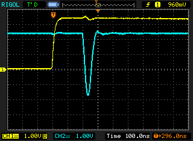

# Comparing different glitching modes

To carry out fault injection attacks, voltage glitching can be applied to the target in various ways.

## Crowbar glitching

Probably the most common and simplest method is so-called crowbar glitching, in which the supply voltage of the microcontroller is pulled to GND for a very short time, as described in section [overview](overview.md).
This method leads to voltage curves similar to the following:

This method is suitable for many targets and is used in particular when large capacitive loads (e.g. capacitors on the power rails) need to be discharged.
However, the crowbar method also has disadvantages. On the one hand, if the crowbar pulse is too long, the target is reset and no fault is usefully induced.
On the other hand, the crowbar pulses must be very precisely timed and very narrow, which poses certain challenges for the electronics used.

## Multiplexing

A second method of voltage glitching is the multiplexing method. This involves rapid switching back and forth between different supply voltages, which can also cause faults in the target. See section [multiplexing](multiplexing.md) for more details.
One advantage of the multiplexing method is that the microcontroller can be supplied with voltage by the same electronics that carry out the voltage glitching. On the other hand, the voltages that lead to a fault can be kept over a longer period of time, which reduces the chance of a hard reset of the target.

A disadvantage is the complex electronics required to switch quickly between different voltage levels.

## Pulse shaping
An even more advanced methode is the pulse shaping methode, first described [here](https://doi.org/10.13154/tches.v2019.i2.199-224).
The key idea here is to use a Digital Direct Synthesis (DDS) to generate an arbitrary pulse form that is amplified and applied to the target.
The advantages of this method are obvious: almost any voltage curve with any intermediate voltages can be defined and generated. The overshoots when switching the voltage through the crowbar transistors or with the multiplexing stage are also eliminated, which ensures a cleaner voltage curve.

The disadvantages of this method are that it requires complicated and high-frequency power electronics with very specialised components. See section [pulse-shaping](pulse_shaping.md) for more details.
