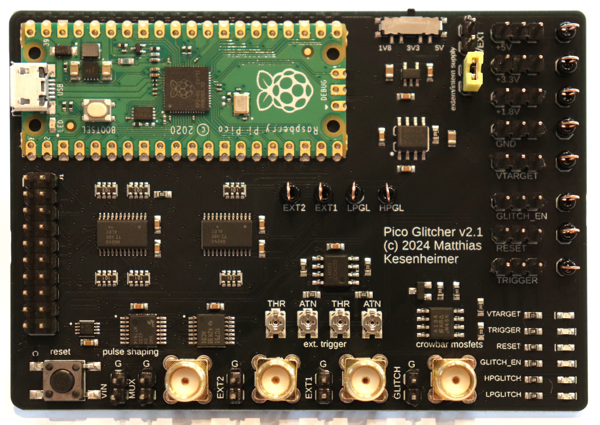

# Welcome to findus (aka fault-injection-library)

This library is intended to make fault injection attacks against microcontrollers accessible for hobbyists and to introduce the topic of voltage glitching.
Findus offers an easy entry point to carry out your own attacks against microcontrollers, SoCs and CPUs.
With the provided and easy to use functions and classes, fault injection projects can be realized quickly.

The fault-injection-library has been built to work with hardware that consists of a common MOSFET, the [Raspberry Pi Pico](https://www.raspberrypi.com/products/raspberry-pi-pico/) as the controller and a few other cheap components.
The Raspberry Pi Pico is not only cheap and available for the hobbyist, but also a very capable microcontroller.
Furthermore, this library supports the [ChipWhisperer Pro](https://rtfm.newae.com/Capture/ChipWhisperer-Pro/) and the [ChipWhisperer Husky](https://rtfm.newae.com/Capture/ChipWhisperer-Husky/) as well.

The Pico Glitcher was developed to minimize the effort and requirements for the hardware setup. The Pico Glitcher is optimized for use with findus and makes it particularly easy to carry out fault injection attacks.

## Where to get the Pico Glitcher from?

The Pico Glitcher and accessories can be obtained from tindie:
[tindie.com/stores/faulty-hardware/](https://www.tindie.com/stores/faulty-hardware/)

## Links and further resources

If you have feature requests or issues, please contact me:

- twitter: [@BartimaeusvUruk](https://x.com/BartimaeusvUruk)
- mastodon: [@mkesenheimer@mastodon.social](https://mastodon.social/@mkesenheimer)
- discord: [discord.gg/8mqEVPG6k7](https://discord.gg/8mqEVPG6k7)
- Pico Glitcher v2: [tindie.com/.../picoglitcher-v2](https://www.tindie.com/products/faulty-hardware/picoglitcher-v2/)
- STM8s target board: [tindie.com/.../stm8-target-board](https://www.tindie.com/products/faulty-hardware/stm8-target-board/)
- Pulse Shaping expansion board: [tindie.com/.../pulse-shaping-expansion-board-v1](https://www.tindie.com/products/faulty-hardware/pulse-shaping-expansion-board-v1/)