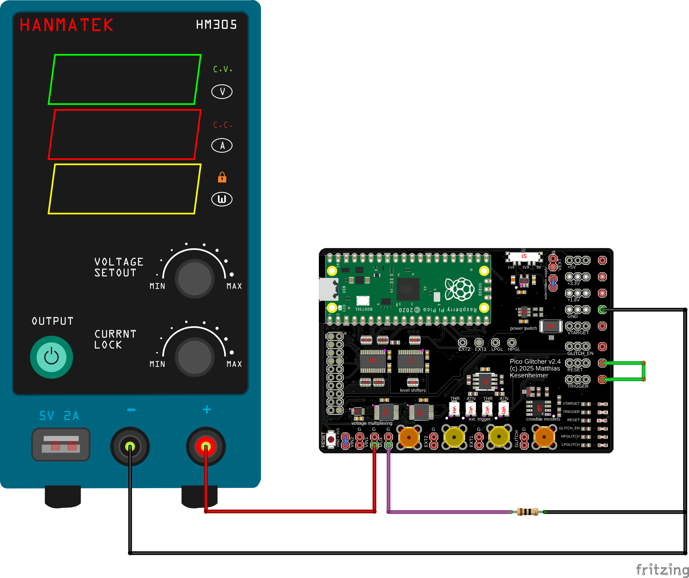
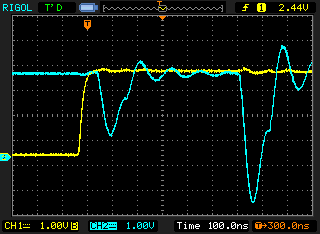

# Multiplexing

Multiplexing is a technique to quickly switch between different supply voltage levels of the microcontroller. Similar to glitching with the [crowbar technique](glitches.md), this can cause a fault in the microcontroller.
A fundamental difference is that with the multiplexing-fault-injection method, the supply voltage of the microcontroller is not pulled to GND, but intermediate voltages can also be used, for example 1.8V or user-defined voltages.
It is also possible to go through a sequence of different supply voltages, so called voltage profiles.

With the second hardware revision of the Pico Glitcher, it is possible to create different voltage profiles and apply them to the supply voltage of the target. This is made possible by the introduction of the multiplexing stage, section [customizing your Pico Glitcher](customize.md#pico-glitcher-v2-gpio-pin-overview).
The multiplexing stage also allows the target to be supplied with power. It is therefore not necessary to additionally supply the target with voltage via the ‘VTARGET’ output.

## Multiplexing test setup

The following setup can be used to test the multiplexing stage of the Pico Glitcher v2:



Note that the power supply is optional and can be used to generate a third, intermediate voltage. Without the additional power supply, the multiplexing stage of the Pico Glitcher can switch between `3.3V`, `1.8V` and `0V`.
See `fault-injection-library/example/pico-glitcher.py` for a complete test script.

## Using the multiplexing stage

Implementing multiplexing in your fault injection campaign is no different to using the crowbar method.
Instead of setting up the crowbar transistors with `self.glitcher.set_lpglitch()` or `self.glitcher.set_hpglitch()`, the Pico Glitcher v2 is configured to use the multiplexing stage with the following command:

```python
from findus import PicoGlitcher

glitcher = PicoGlitcher()
glitcher.init(port='/dev/ttyACM0')
glitcher.rising_edge_trigger()

glitcher.set_multiplexing()
```

Side note: you can also make use of the new trigger inputs of the Pico Glitcher v2 by calling `glitcher.rising_edge_trigger(pin_trigger="ext1")`, described [here](schmitt.md). These trigger inputs are buffered by an adjustable Schmitt Trigger. If you do not provide the argument `pin_trigger` the default trigger input will be used.

After initializing the Pico Glitcher v2, the multiplexing profile must be defined and the glitcher can be armed. This is typically done in the `while`-loop of the glitching script (see for example `fault-injection-library/example/pico-glitcher.py`).

```python
mul_config = {"t1": 100, "v1": "1.8", "t2": length, "v2": "GND"}
glitcher.arm_multiplexing(delay, mul_config)
```

The above profile, for example, will send a pulse of `1.8V` for `100ns`, followed by a 'crowbar' pulse of duration `length`, resulting in the following voltage trace:


## Example of voltage profiles

The software for controlling the multiplexing stage is extremely flexible and a vast number of voltage profiles with countless parameterizations can be generated.
Up to four different voltage steps can be parametrized and utilized with the general multiplexing configuration similar to
```python
mul_config = {"t1": t1, "v1": "GND", "t2": t2, "v2": "1.8", "t3": t3, "v3": "VCC", "t4": t4, "v4": "3.3"} 
```
where `VCC` is a user-supplied voltage level by the `VIN` input.

Below are some examples of voltage traces that can be applied to the target.

- `1.8V` voltage step, custom voltage of `0.95V`, followed by a pull to GND (`mul_config = {"t1": 4000, "v1": "1.8", "t2": 4000, "v2": "VCC", "t3": 1000, "v3": "GND"}`):


- `1.8V` voltage step followed by a pull to GND (`mul_config = {"t1": t1, "v1": "1.8", "t2": length, "v2": "GND"}`):


- `1.8V` voltage step, `3.3V` voltage step, crowbar pull to GND (`mul_config = {"t1": t1, "v1": "1.8", "t2": t2, "v2": "3.3", "t3": length, "v3": "GND"}`)



- double glitch (one to GND, the other to `1.8V`), separated by `400ns` (`mul_config = {"t1": length, "v1": "GND", "t2": 400, "v2": "3.3", "t3": length, "v3": "GND"}`, `mul_config = {"t1": length, "v1": "1.8", "t2": 400, "v2": "3.3", "t3": length, "v3": "1.8"}`):


- GND pull, `1.8V` voltage step, GND pull, second `1.8V` voltage step (`mul_config = {"t1": length, "v1": "GND", "t2": 2*length, "v2": "1.8", "t3": 2*length, "v3": "GND", "t4": length, "v4": "1.8"}`):


By using the multiplexing stage, the possible parameter combinations can increase exponentially, which makes the search for suitable parameters more difficult. Of course, one can also keep multiple parameters constant and only vary one specific parameter. Another option is to vary all parameters and apply a [genetic algorithm](genetic.md) to the search space to find suitable parameters.

## Technical details
In order to switch quickly between different voltage levels, the chip 'TS3A4751' from Texas Instruments is used. This chip is a 4-channel analog switch in SPST (single-pull-single-through) configuration.
To make the analog switch easier to control and to reduce the signal lines from the Raspberry Pi Pico to the analog switch, a digital demultiplexer is used ('SN74LVC1G139DCUT'). Since the voltage levels are reversed after the demultiplexer, a 4-channel not-gate is used to reverse the voltage levels.


This setup seems rather complicated to switch between four different voltage levels. However, the choice of analogue switches is not exactly extensive or does not match the requirements of a fast-switching fault-injection device. The required properties of the analogue switch are as follows:

- Fast switching: less than 5ns switching time.
- Number of channels: four channels for flexible switching between as many voltage levels as possible.
- Low resistance: to avoid switching losses, a low resistance of 1Ω or less is required.
- High output current: a high continuous current of at least 100mA is needed to keep the device powered even for a long time. This maximum current should be suitable for most microcontrollers.

All these requirements are met by the 'TS3A4751', even if the choice of this chip has made controlling it a little more complicated.
