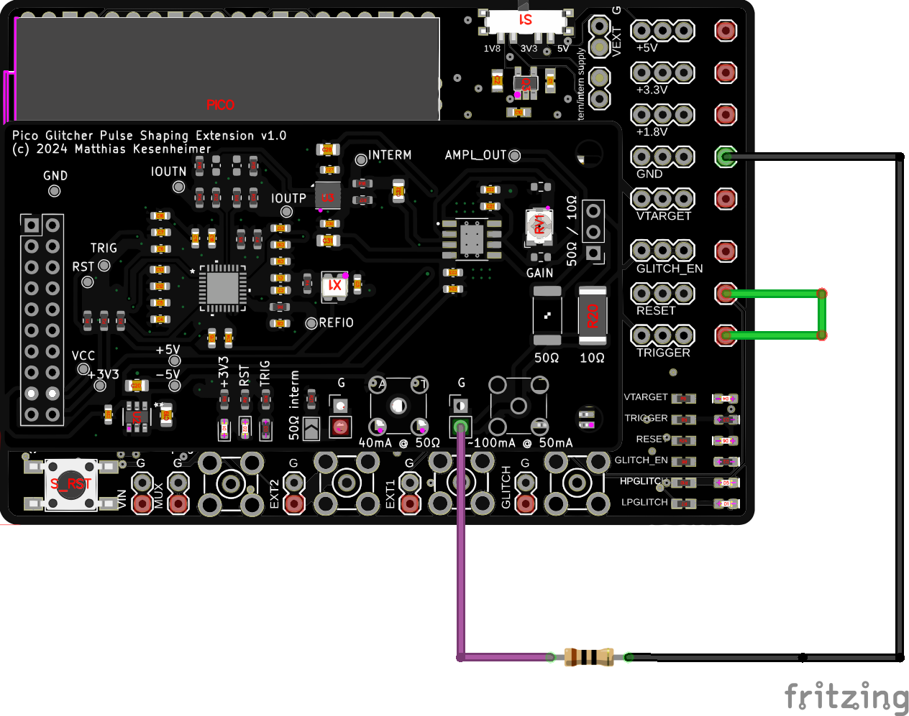
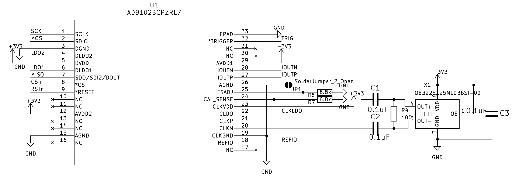
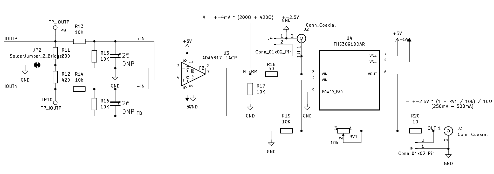
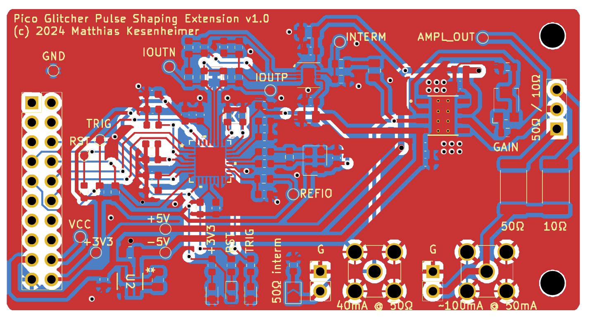

# Pulse-Shaping

As described previously in section [comparing different glitching modes](glitches.md), pulse-shaping is the method of generating arbitrary voltage profiles that are appplied to the power rail of the target device.

This method was introduced to the Pico Glitcher v2 with a special expansion board and is described briefly in the following.

## Pulse-shaping test setup

The following test setup can be used to test the pulse-shaping expansion board of the Pico Glitcher v2:

## Using the pulse-shaping stage

--- TODO ---

## Example of voltage profiles

--- TODO ---

## Technical details

The waveform generator AD9102 from Analog devices was chosen and is used to generate arbitrary voltage profiles.
This chip is a high performance digital-to-analog converter (DAC) integrating on-chip pattern memory for complex waveform generation with a direct digital synthesizer (DDS).
The key features of the chip are:

- On-chip 4096 × 14-bit pattern memory
- 180 MSPS pattern generator
- SPI interface to connect to the Pico Glitcher v2

The following circuit is used for the Pico-Glitcher v2 expansion board to amplify the signals from the DDS:

The requirements to the power amplifier are as follows:

- High slew rate for clean and steep signals: >7000 V/μs.
- Wide bandwidth of up to 200MHz.
- High output current to supply the target with power: >±200 mA

