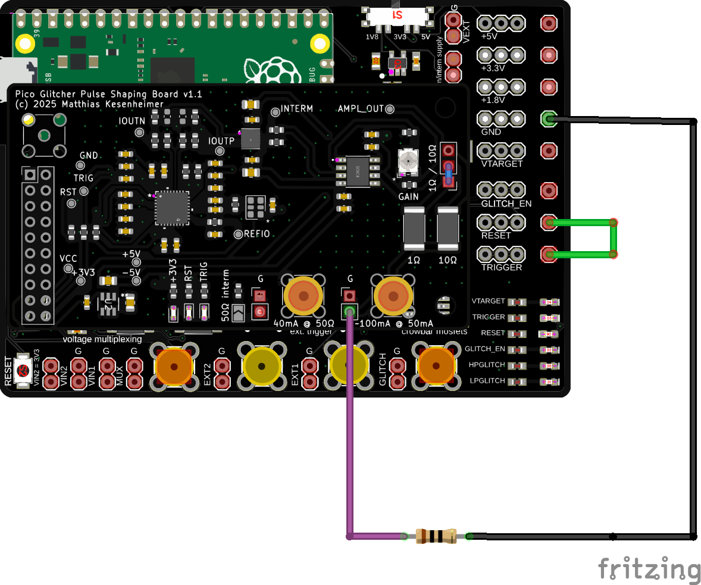

# Pulse-Shaping

The pulse-shaping stage of the Pico Glitcher allows for fine-tuned control over glitch waveforms by defining voltage transitions over time. This technique is useful for more sophisticated fault injection attacks where simple square-wave glitches might not be effective.

As described previously in section [comparing different glitching modes](glitches.md), pulse-shaping is the method of generating arbitrary voltage profiles that are appplied to the power rail of the target device.

This method was introduced to the Pico Glitcher v2 with a special expansion board and is described briefly in the following.

## Pulse-shaping test setup

The following test setup can be used to test the pulse-shaping expansion board of the Pico Glitcher v2:



## Using the pulse-shaping stage

Before using the pulse-shaping functionality, the Pico Glitcher needs to be initialized:

```python
from findus import PicoGlitcher

glitcher = PicoGlitcher()
glitcher.init(port='/dev/ttyACM0')

glitcher.rising_edge_trigger()

# choose pulse-form glitching
glitcher.set_pulseshaping(vinit=3.3)
```

- `glitcher.rising_edge_trigger()`: To ensure the glitch is applied at the correct moment, a trigger condition needs to be defined. Here, we use a rising edge trigger.
- `glitcher.set_pulseshaping(vinit=3.3)`: Instead of a simple voltage drop, the pulse-shaping mode allows defining a more complex glitch waveform. The pulse-shaping capabilities are initialized and the initial voltage of `3.3V` is applied.

To create a smooth glitch waveform, we define a time-voltage spline:

```python
tpoints = [  0,  20, 40,  60,  80]
vpoints = [3.3, 2.7,  0, 2.7, 3.3]
glitcher.arm_pulseshaping_from_spline(delay, tpoints, vpoints)
```

- `tpoints`: A list of time points (in nanoseconds) where voltage changes occur.
- `vpoints`: The corresponding voltage levels at each time point.
- `arm_pulseshaping_from_spline(delay, tpoints, vpoints)` configures the Pico Glitcher to apply a shaped glitch after a specified delay.

By following these steps, the Pico Glitcher is configured to apply a precise, smooth voltage glitch instead of a sharp transition, making it more effective in certain fault injection scenarios.

## Other examples
Here are a few examples on how to quickly generate different voltage traces with multiple pre-defined functions.
See `fault-injection-library/example/pico-glitcher-pulse-shaping.py` for the comlpete script.

- Pulse-shaping with a configuration similar to multiplexing (without interpolation):
```python
ps_config = [[length, 2.0], [length, 1.0], [length, 0.0], [length, 3.3]]
glitcher.arm_pulseshaping_from_config(delay, ps_config)
```


- A voltage trace defined from a lambda:
```python
ps_lambda = f"lambda t:2.0 if t<{length} else 1.0 if t<{2*length} else 0.0 if t<{3*length} else 3.0"
glitcher.arm_pulseshaping_from_lambda(delay, ps_lambda, 10*length)
```


- A pulse from a lambda; ramp down to `1.8V` than `GND` glitch:
```python
ps_lambda = f"lambda t:-1.0/({2*length})*t+3.0 if t<{2*length} else 2.0 if t<{4*length} else 0.0 if t<{5*length} else 3.0"
glitcher.arm_pulseshaping_from_lambda(delay, ps_lambda, 6*length)
```


- A voltage trace from a raw list:
```python
pulse = [-0x1fff] * 50 + [-0x0fff] * 50 + [-0x07ff] * 50 + [0x0000] * 50
glitcher.arm_pulseshaping_from_list(delay, pulse)
```


- Pulse from time-voltage coordinates, interpolated in between:
```python
xpoints = [0,   100, 200, 300, 400, 500, 515, 520]
ypoints = [3.0, 2.1, 2.0, 2.0, 1.7, 0.0, 2.0, 3.0]
glitcher.arm_pulseshaping_from_spline(delay, xpoints, ypoints)
```


## Plotting requested pulses in real time

To observe the generated voltage traces while they are generated, the function `Spline.interpolate_and_plot(xpoints, ypoints)` can be used:

```python
from findus.firmware.Spline import Spline
[...]

xpoints = [0,   100, 200, 300, 400, 500, 515, 520]
ypoints = [3.0, 2.1, 2.0, 2.0, 1.7, 0.0, 2.0, 3.0]
glitcher.arm_pulseshaping_from_spline(delay, xpoints, ypoints)
Spline.interpolate_and_plot(xpoints, ypoints)
```


Run the script `fault-injection-library/examples/pico-glitcher-pulse-shaping.py` with the following parameters:

```bash
python pico-glitcher-pulse-shaping.py --rpico /dev/tty.<rpi-tty-port> --delay 10 10 --length 100 100 --pulse-type 5
```

## Interactive PCHIP Editor

Alternatively, the interactive PCHIP (Piecewise Cubic Hermite Interpolating Polynomial) editor can be used to generate a voltage trace.
The PCHIP editor is a tool which enables you to drag and drop multiple points that define the voltage trace. Interpolation is used to generate the intermediate points.

Import the respective module and initialize the PCHIP editor with `InteractivePchipEditor()`:
```python
from findus.InteractivePchipEditor import InteractivePchipEditor
editor = InteractivePchipEditor()
```

The following commands open the editor and retrieve the points in real-time:
```python
editor.show(block=False)
xpoints, ypoints = editor.get_points()
glitcher.arm_pulseshaping_from_spline(delay, xpoints, ypoints)
```

Here are two examples of voltage traces generated by the PCHIP editor:


See `fault-injection-library/examples/pico-glitcher-pulse-shaping.py` for more details.
The above example can be executed by running:

```bash
python pico-glitcher-pulse-shaping.py --rpico /dev/tty.<rpi-tty-port> --delay 10 10 --length 100 100 --pulse-type 6
```

## Calibration

Since the gain of the amplifier of the pulse-shaping expansion board depends on a lot of things, the output of the expansion board has to be calibrated.

This can be done by executing the command-line tool `pulse-calibration` (should be installed with findus) and by measuring the voltage trace with an oscilloscope:

```bash
pulse-calibration --rpico /dev/tty.<rpi-tty-port>
```

To perform a calibration routine

- Connect `TRIGGER` and `RESET`.
- Turn gain potentiometer of Pulse Shaping Expansion board all the way to the left (lowest gain).
- Connect your oscilloscope to pulse output of the Pulse Shaping Expansion board and to `TRIGGER` for triggering.
- Observe pulse.
- Measure maximum and minimum voltage of the generated pulse (`vhigh` and `vlow`). Take note and abort execution.
- Execute this script again with the found values for `vhigh` and `vlow` and check if the pulse aligns with `GND`.
- Note that the found calibration values are stored on the Pico Glitcher persistently if this script is called with values for `vhigh` and `vlow`.

For example, to apply and store the calibration, execute:
```bash
pulse-calibration --rpico /dev/tty.<rpi-tty-port> --vhigh 1.5 --vlow -0.5
```

## Technical details

The waveform generator AD9102 from Analog devices was chosen and is used to generate arbitrary voltage profiles.
This chip is a high performance digital-to-analog converter (DAC) integrating on-chip pattern memory for complex waveform generation with a direct digital synthesizer (DDS).
The key features of the chip are:

- On-chip 4096 × 14-bit pattern memory
- 180 MSPS pattern generator
- SPI interface to connect to the Pico Glitcher v2


The following circuit is used for the Pico-Glitcher v2 expansion board to amplify the signals from the DDS:


The requirements to the power amplifier are as follows:

- High slew rate for clean and steep signals: >7000 V/μs.
- Wide bandwidth of up to 200MHz.
- High output current to supply the target with power: >±200 mA


