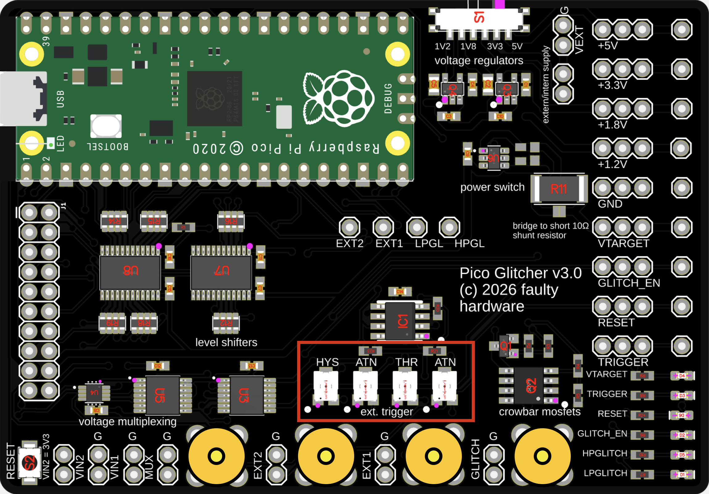

# Schmitt Trigger EXT inputs

The trigger inputs `EXT1` and `EXT2` are particularly useful for noisy logic signals, as the noise can be easily suppressed by the adjustable Schmitt Trigger.
If, for example, the signal oscillates or is disturbed in any other way, this disturbances can be cut off by selecting a suitable threshold.

Use the potentiometer labeled `THR` to adjust the threshold of the Schmitt Trigger.
The threshold is lowered by turning the potentiometer to the left.

The potentiometer `ATN` can be used for an additionally signal reduction, if necessary. Turning the potentiometer all the way to the right disables attenuation and uses the full signal range.

Changes have been made in version 3 to the `EXT2` trigger input. Now the hysteresis of the trigger behavior can be adjusted.

The HYS potentiometer is used to adjust the hysteresis of the Schmitt trigger input EXT2. It controls the difference between the upper and lower switching thresholds. By changing this difference, it directly determines how much the input signal must move before the output changes state.

With no hysteresis, the Schmitt trigger switches at the same input level for both rising and falling edges. The output changes state exactly at a single threshold, making the circuit sensitive to noise and small fluctuations around that level.

When hysteresis is introduced, the switching point depends on the direction of the input signal. On a rising input, the signal must reach the upper threshold before the output changes, causing the transition to occur later than it would without hysteresis. On a falling input, the signal must drop below the lower threshold before switching back, which also delays the transition compared to a single-threshold comparator.

Increasing the hysteresis widens the gap between the upper and lower thresholds. This makes the circuit switch later on both rising and falling edges, relative to the no-hysteresis case. Reducing the hysteresis narrows this gap, bringing the two switching points closer together until they coincide when hysteresis is effectively zero.

This behavior is what gives the Schmitt trigger its noise immunity: small variations around the switching level do not cause repeated transitions, and the exact timing of state changes can be deliberately shifted by adjusting the hysteresis.