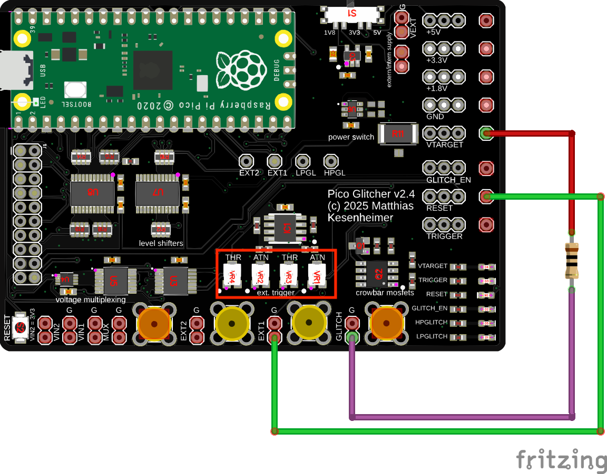

# Schmitt Trigger EXT inputs

The trigger inputs `EXT1` and `EXT2` are particularly useful for noisy logic signals, as the noise can be easily suppressed by the adjustable Schmitt Trigger.
If, for example, the signal oscillates or is disturbed in any other way, this disturbances can be cut off by selecting a suitable threshold.

Use the potentiometer labeled `THR` to adjust the threshold of the Schmitt Trigger.
The threshold is lowered by turning the potentiometer to the left.

The potentiometer `ATN` can be used for an additionally signal reduction, if necessary. Turning the potentiometer all the way to the right disables attenuation and uses the full signal range.
