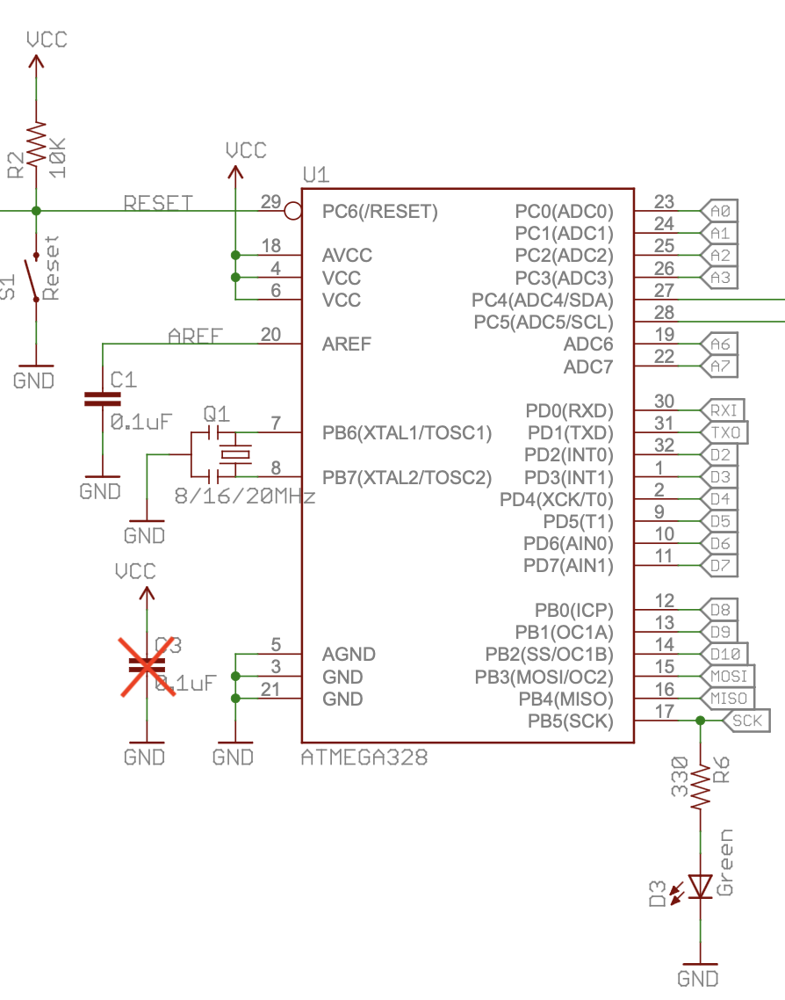
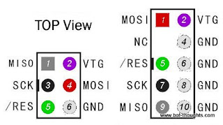

# Attacking the ATMEGA328P

## Prerequisites

- avrdude
- gcc-avr
- avr-gdb
- binutils-avr
- avr-libc

The installation on macOS is given below.
Installation on other platforms should be similar.

### Commands to install avr-gcc on macOS

```bash
brew tap osx-cross/avr
brew install avr-gcc avr-gdb avr-binutils
```

## Setup



### Wiring


Wire JTAGICE3 ISP pins to the ATmega328P:

```
MISO → MISO (PB4)
MOSI → MOSI (PB3)
SCK → SCK (PB5)
RESET → RESET
VCC → VCC
GND → GND
```

## Programming and Reading

The following commands can be used to program the chip, set the lock bits and read from flash:

### Programming

Write program to flash:

```bash
avrdude -F -c jtag3isp -p m328p -U flash:w:blink.hex:i
```

Setting fuses:

* Low fuse (lfuse): 0xFF -> external crystal, no CKDIV8
* High fuse (hfuse): 0xDE -> SPIEN enabled, bootloader reset + 0.5 KB boot section, EESAVE not set
* Extended fuse (efuse): 0x05 -> sets brown-out detection at 2.7 V

```bash
avrdude -F -c jtag3isp -p m328p \
  -U lfuse:w:0xFF:m \
  -U hfuse:w:0xDE:m \
  -U efuse:w:0x05:m # or 0xFD on newer avrdude
```

### Enable readout protection

* 0xFF = unlocked (default)
* 0x00 = full lock (chip only erasable, not readable)
* 0xFC = no programming, no verify/read (strongest: code protected)

```bash
avrdude -F -c jtag3isp -p m328p -U lock:w:0x00:m
```

### Disable readout protection and erase flash

```bash
avrdude -F -c jtag3isp -p m328p -e
```

### Reading

Dump flash:
```bash
avrdude -F -c jtag3isp -p m328p -U flash:r:dump.hex:i
```

Read fuses:
```bash
avrdude -F -c jtag3isp -p m328p -U lfuse:r:lfuse.hex:h -U hfuse:r:hfuse.hex:h -U efuse:r:efuse.hex:h
```

Read lock bits:
```bash
avrdude -F -c jtag3isp -p m328p -U lock:r:lock.hex:h
```

Read lock bits to stdout:
```bash
avrdude -F -c jtag3isp -p m328p -U lock:r:-:h
```
