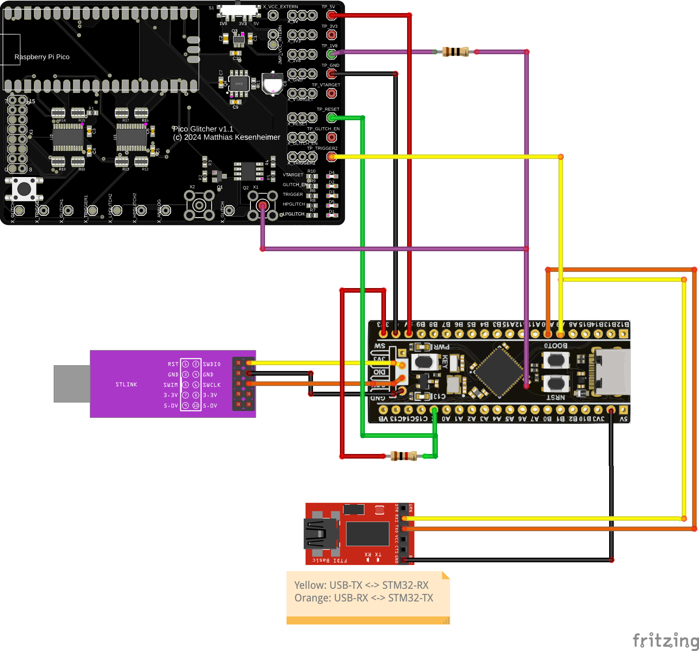
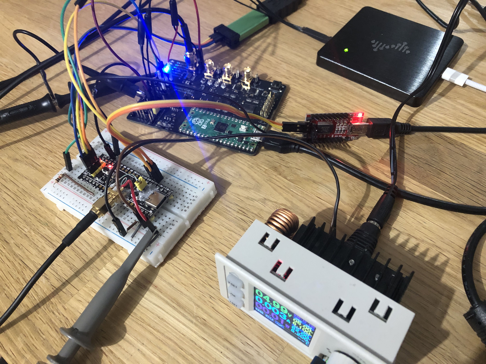
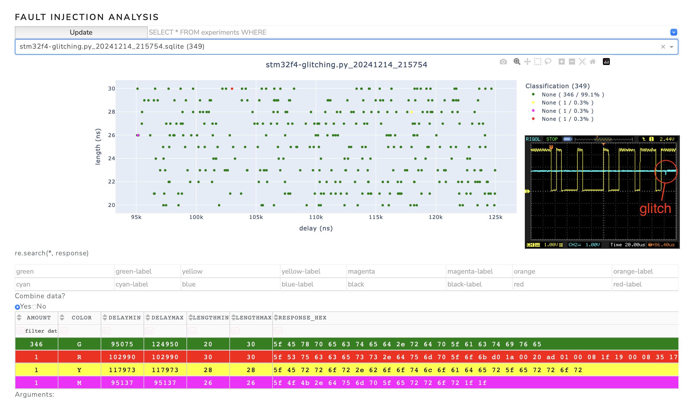
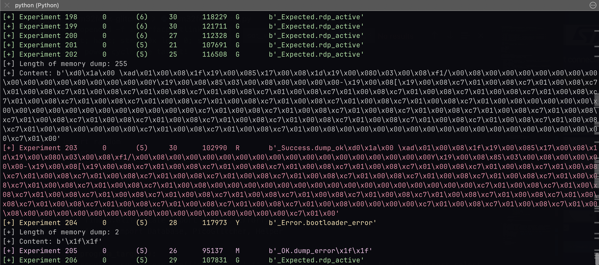

# Notes

Short notes for the attacks on the STM32F40x microcontroller series.

## Short Summary

- This script attacks the read memory command while the microcontroller is in bootloader mode 
- This attack is similar to the attacks on the [STM8](https://github.com/MKesenheimer/fault-injection-library/tree/master/projects/stm8s) microcontroller
- A glitch is sent immediately after the read memory command (0x11ee)
- If the glitch is successful, the microcontroller responds with an ACK
- To get the memory contents of the flash, the script sends the following commands to set the address to read from and the number of bytes to read from that address
- To get the full flash back, the glitch is executed several times and the address to read from is increased accordingly.

Note that this script is for research only and is not intended to run on a real target. For example, if the script detects an error (such as a PCROP bit set), the microcontroller will be reprogrammed and all content will be lost. Make sure you understand what this script does and modify it to suit your needs.

Look into the [image folder](images) for more details.

A detailed write-up can be found [here](https://mkesenheimer.github.io/blog/glitching-the-stm32f4.html).

## Schematics

## Black Pill setup

## Parameterspace

## Successful dump

