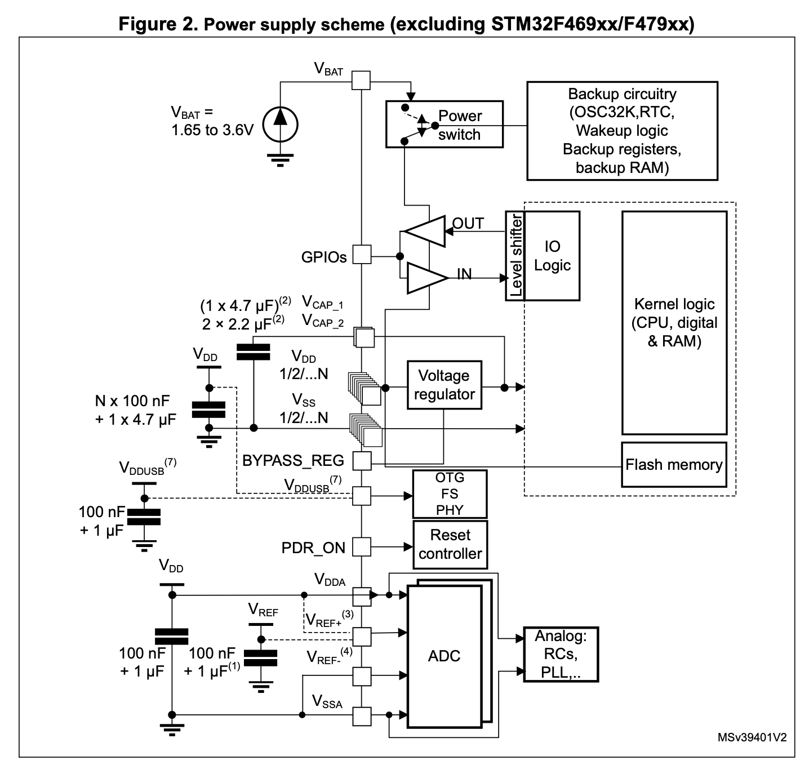
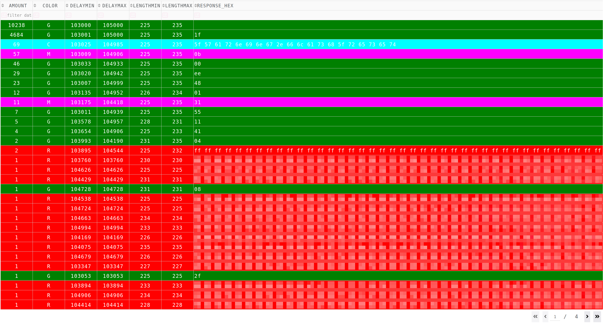

# Notes

## Short Summary

- Capacitors V_CAP_1 and V_CAP_2 have to be removed. Glitch is inserted on V_CAP line.

- Successful glitches and memory dumps in the following parameter range (PicoGlitcher):
  
  ```bash
  python pico-glitcher.py --rpico /dev/<PicoGlitcher-tty-port> --target /dev/<target-tty-port> --delay 103_000 105_000 --length 225 235
  ```

- Flash gets erased occasionally while glitching -> target has to be reprogrammed.

- Bootloader code (address 0x1fff0000) can be dumped and reverse engineered.

- [AN2606 Application note STM32 microcontroller system memory boot mode](https://www.st.com/resource/en/application_note/an2606-stm32-microcontroller-system-memory-boot-mode-stmicroelectronics.pdf)


[AN4488 Application note](https://www.st.com/resource/en/application_note/an4488-getting-started-with-stm32f4xxxx-mcu-hardware-development-stmicroelectronics.pdf)

## Images

This is what it looks like if observering the Vcore (yellow, where we glitch) and the serial transmission (green) from the device. The bit pattern shown is that of 0x1f - NACK - we're not allowed to continue our Read Memory request due to RDP.


When the glitch is successful, we can see that the bit pattern now has changed to that of 0x79 - ACK - and we can continue sending the wanted memory address and length.


Closeups of the actual Vcore glitch. The amount of "ringing" (overshoot) after the glitch seems to correlate with what actions the glitch caused the device to take afterwards.


## Example statistics

Reading out the bootloader (~24kB in size, v3.1) takes a few hours. As can be seen from the statistics, during that time we had 69 occasions (cyan) where the internal flash of the device was _possibly_ cleared. 96 successful glitched Read Memory requests (red) were needed, from a total of  ~15000 tries in total. Magenta indicates a successful glitch but where the device was no longer responding according to what Read Memory should (wrong execution path likely reached) and the various green rows indicate responses that were either expected (NACK) or anything else besides ACK.



## Why this target is difficult to glitch

The current method for glitching STM32F4* relies on sending a Read Memory request to the STM bootloader via USART, picking up the sent byte on the serial line and then waiting a fix amount of nanoseconds before activating the glitch. However, due to the interaction between the serial clock and the CPU clock this method is wildly inexact. Looking at the red rows in the picture above we can clearly see that the delay at which we got successful glitches varies over 2000 ns. This also means that we're glitching all sorts of code paths during these tries, and some of those cause unintended and serious side effects.

The STM bootloader checks the received command byte with one long sequence of compares and jumps. Glitching during the time this code is run can cause execution to continue in another bootloader command method. We're also not currently able to "hook" onto some other indicator of where the bootloader is currently in it's execution, which would be needed for a much more exact exploit without the risk of clearing the internal flash memory.
